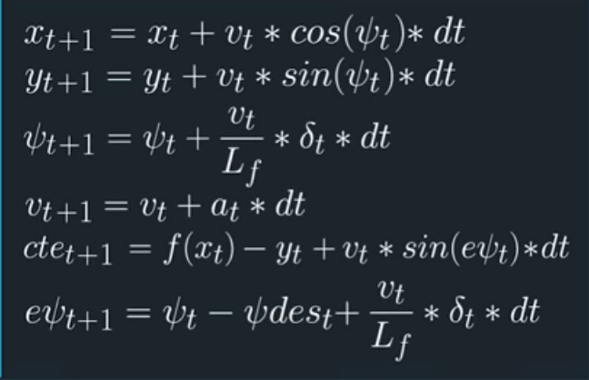

**Model predictive Controller**
---

**Model predictive Controller Project**

The goals of this project are the following:

* Implement the Model predictive Controller to keep the vehicle in the middle of the lane
* Run the implemented algorithm on the simulator
* Summarize the results with a written report

## Project Basics
In this project, I used C++ to write a program a Model predictive Controller to keep the vehicle in the middle of the lane.

See files in the 'src' folder for the primary C++ files making up this project.
---

### The Model

we use the kinematic model of the car to represent our model and predict the next states from the current state.

Here are the equations that represent the kinematic model mathematically:

| variable |   description   |
| ----- | ------- |
|  x   | x position of the car |
|  y   | y position of the car |
|  psi   | angel between the car and the x axis |
|  v   | velocity of the car |
|  cte   | distance between the car and the desired path |
|  epsi   | angel between the orientation of the car and the desired orientation |
|  delta   | steering angel |
|  a   | throttle  |
|  dt   | time difference between each state  |
|  Lf   | length from front to CoG that has a similar radius  |

And the MPC use this model in the solver to get the best throttle and steering values for the optimal path:

### Timestep Length and Elapsed Duration (N & dt)

T=N*dt

T should be large(second or more) but dt should be small. I started with N=10 and dt =0.1 and that were good values.

### Polynomial Fitting and MPC Preprocessing

I transformer the values from the map's coordinates to the car coordinates.

Then I fitted the transformed positions by a third order polynomial to use it as a desired path.

And finally passed this polynomial coefficients to the solver to use it.

### Model Predictive Control with Latency

To compensate the Latency of the system (100 millisecond), I made it part of the model by predicting (from the kinematic model)the state vector after the Latency time and send it as the initial state vector.

### Results

Here is the result of the MPC algorithm:

